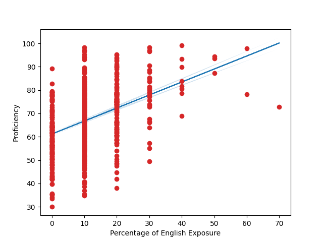
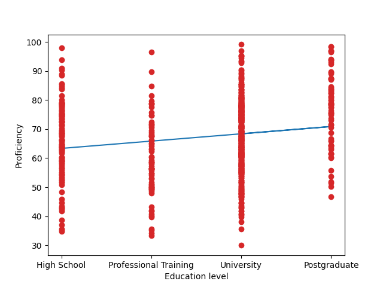
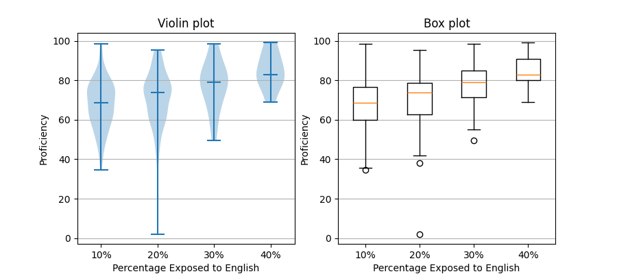
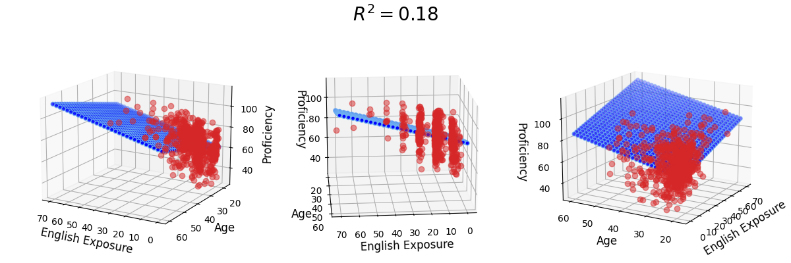

# Language Proficiency Estimator

[](https://app.netlify.com/sites/language-proficiency-estimator/deploys)

An AI powered web-app for estimating language proficiency expectations of adult English learners. 

## [Live Demo](https://language-proficiency-estimator.netlify.app)

The application can be accessed at the following URL:

https://language-proficiency-estimator.netlify.app

## Running the application locally

To run the application locally for evaluation or development purposes:

1. Start the backend server
2. Start the frontend server
3. Visit `http://localhost:5173` in a web browser

### 1. Starting the backend server

Requires Python 3

#### Install dependencies

The backend server requires the following python packages to be installed: (See `backend/requirements.txt`)

- Flask
- torch
- flask_cors
- scikit-learn
- matplotlib
- numbpy
  
These may be installed by using `pip` / `pip3`

```bash
pip3 install Flask torch flask_cors scikit-learn matplotlib
```

Or in Unix-like environments, they may also be installed using `venv` from the `backend` directory.

```bash
python3 -m venv .venv
source .venv/bin/activate
python3 -m pip install -r requirements.txt
```

#### Launching the server

Once the dependancies have been installed, the server may be started by running the following command from the `backend` directory.

```bash
flask run
```

### 2. Starting the frontend server

#### Install dependencies

Node (v. 18 or greater) and npm are required. From the `frontend` directory run the following:

```bash
npm install
```

#### Launching the server

```bash
npm run dev
```

The full working application should now be accessible at `http://localhost:5173`

## Deployment:

### Backend

The backend can be deployed using [Fly.io](https://fly.io/). To deploy, [install flyctl](https://fly.io/docs/flyctl/) and then from the `backend` directory run:

```bash
fly deploy
```

### Frontend

#### Environment variables:

Building the frontend for production deployment requires the following environment variable to be set:

- `VITE_PROFICIENCY_API` - URL for the backend proficiency model API (defaults to `http://localhost:500`)
  
#### Building

To build the frontend for deployment run the following command from the `frontend` directory:

```bash
npm run build
```

The `frontend/dist` directory contains the packaged front-end files for deployment.


## Training the model

This repository includes a pre-trained model at `backend/model.pt`. But you can also train it by running the following from the `backend` directory.

```bash
python3 train.py
```

## Dataset and Visualizations

The model has been trained on the [BEST Dataset of Language Proficiency](https://www.frontiersin.org/journals/psychology/articles/10.3389/fpsyg.2017.00522/full). Below are some visualizations of the data from this dataset.








